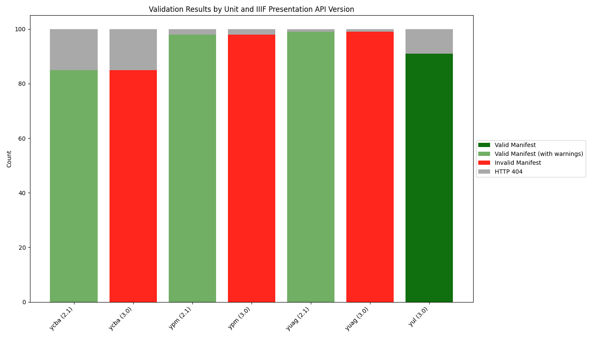

# IIIF Consistency

1. The `validate_urls.sh` script validates IIIF URLs using a local version of the IIIF Presentation API Validator. It checks if the IIIF resources are properly formatted and generates a [JSONL file](lux-iiif-results.jsonl) with the results.
2. The `lux-iiif-analysis.py` script produces a visualisation with some statistics using the JSONL file. 

